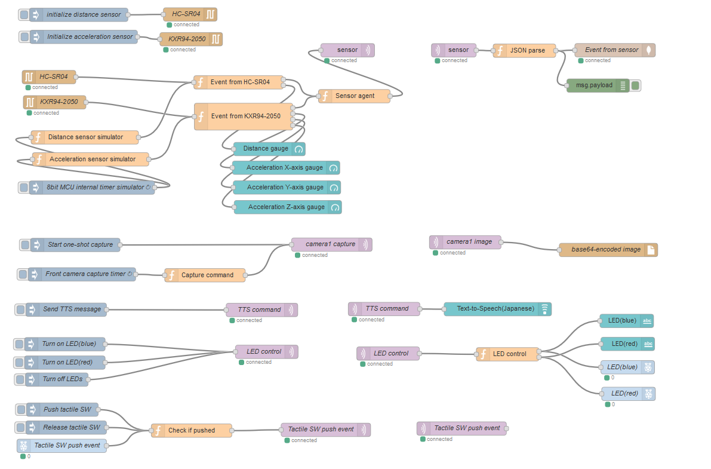
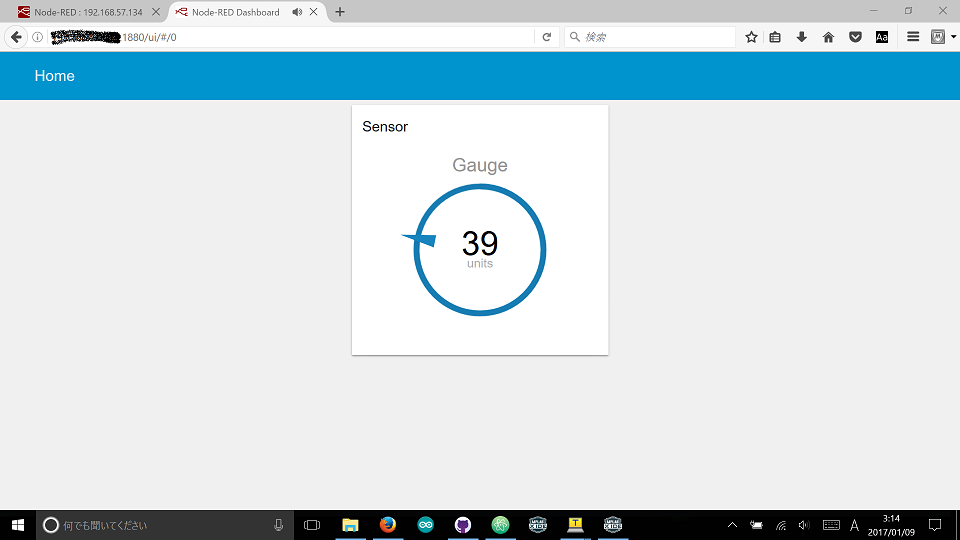

# IoT low level blocks


## Background and motivation

I use PIC to develop sensors/actuators for IoT.

This repo has low level blocks for IoT:

```
                            DC 5V
                              |
                              V
                           +-----+                      
[sensor block 1]---USB-----|     |                      (        )
[sensor block 2]---USB-----| USB |----[IoT gateway]----(  Cloud   )
[actuator block 1]---USB---| hub |    such as RasPi     (        )
[actuator block 2]---USB---|     |
                           +-----+
```

Note: I use MPLAB Code Configurator (MCC) to generate code for USART, I2C etc.

## Blocks

- [Distance sensor block (HC-SR04)]
- [Orientation sensor block (HMC5883L and L3GD20)](./orientation.X)
- [Servo motor actuator block (TowerPro sg90)]
- [USB-UART bridge with 5V supply]
- [USB-UART bridge with 3.3V supply](./doc/STEP_DOWN.md)

## PIC16F models

I mainly use PIC16F1825 or PIC16F1823.

|Model     |pins |Characteristics                         |
|----------|-----|----------------------------------------|
|PIC16F1508|20   |High-resolution PWM with CLCs           |
|PIC16F1823|14   |Serial communications                   |
|PIC16F1825|14   |Serial communications, large memory size|

## Working with Node-RED

All the blocks just use USB as an interface to IoT gateway, so it is very easy to integrate these blocks with Node-RED.

I run Node-RED on my RasPi 3:




