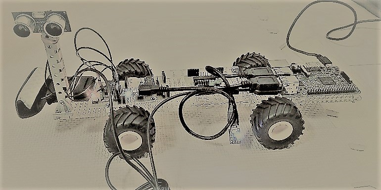
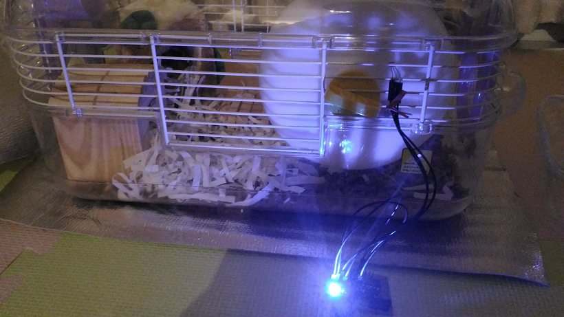

# Blocks: pretty-easy IoT



## Background and motivation

GPIO, I2C, SPI and UART/USART are widely adopted by sensor/actuator components. However, IT guys are not familiar with those low-level interfaces. I have decided to develop a gateway that works as a bridge between those low-level interfaces and serial (UART/USB).

In addition, I want to develop something like "Software-Defined Networking of Things". Once I was involved in several SDN(Software-Defined Networking) projects, but my focus this time is on very low level interfaces (GPIO/I2C/SPI/UART) and very primitive components (sensors/actuators).

## Low-level blocks

IoT is Internet of Things. Sensors/actuators communicate with other sensors/actuators or with human being. IoT is not a new concept at all. IoT is about opening up vertically-integrated legacy systems with IP (internet Protocol).

Most of sensors/actuators require some sort of gateway to be able to speak IP. They call it IoT gateway.

I focus on opening up sensors/actuators in a LEGO-block manner. In this project, I develop "open" sensors/actuators following the architecture below:

```

<--- IoT low-level block ---->
sensor
actuator      MCU     Comm. module    IoT gateway
  +---+      +---+      +---+         +---
  |   |      |   |      |   |         | Win PC
  |   |--*1--|   |--*2--|   |---USB---| RasPi
  |   |      |   |      |   |         | OpenWrt
  +---+      +---+      +---+         +---

*1 GPIO/I2C/SPI/UART
*2 UART
```
I mainly use Microchip PIC16F1 series 14 pins MCU to develop the blocks.

## USB/UART (i.e., serial) as universal interface for IoT blocks

All the blocks support USB/UART interface. I define two types of bridges to connect the blocks to the Internet.

I use FTDI's USB-UART bridge. Linux automatically load a driver for FTDI chip and recognizes it as "/dev/ttyUSB*" device.

IoT blocks with FTDI's USB-UART bridge(*1):
```
                                   +-----+                      
[sensor block 1]-UART-[*1]---USB---|     |                    (        )
[sensor block 2]-UART-[*1]---USB---| USB |---[IoT gateway]---( Internet )
[actuator block 1]-UART-[*1]--USB--| hub |    such as RasPi   (        )
[actuator block 2]-UART-[*1]--USB--|     |    or OpenWrt
                                   +-----+
```

Note: In case of PIC16F1455/1459, USB-UART bridge is unnecessary.

IoT blocks with MQTT-UART bridge:
```
                   MQTT-UART bridge
                      +-------+                (        )
[sensor block 3]-UART-|ESP8266|---MQTT/WiFi---( Internet )
                      +-------+                (        )            
```

## PIC16F1 models

|Model     |# of pins |Characteristics                 |
|----------|-----|--------------------------------|
|[PIC16F1455](http://ww1.microchip.com/downloads/en/DeviceDoc/40001639B.pdf)|14   |Built-in USB                    |
|[PIC16F1459](http://ww1.microchip.com/downloads/en/DeviceDoc/40001639B.pdf)|20   |Built-in USB                    |
|[PIC16F1508](http://ww1.microchip.com/downloads/en/DeviceDoc/41609A.pdf)|20   |CLCs                            |
|[PIC16F1509](http://ww1.microchip.com/downloads/en/DeviceDoc/41609A.pdf)|20   |CLCs                            |
|[PIC16F1825](http://ww1.microchip.com/downloads/en/DeviceDoc/41440A.pdf)|14   |Variety of Serial communications|
|[PIC16F1829](http://ww1.microchip.com/downloads/en/DeviceDoc/41440A.pdf)|20   |Variety of Serial communications|

## Communication modules

- [USB-UART bridge with 5V supply]
- [USB-UART bridge with 3.3V supply](./doc/STEP_DOWN.md)
- [ESP8266(ESP-WROOM-02)]
- [USB Micro B connector(for PIC16F1455/1459)](http://akizukidenshi.com/catalog/g/gK-06656/)

## Base board prototyping

#### Base board prototype #2

This prototype uses PIC16F1825. It costs around $3, much cheaper than A*duino, but it requires one hour for soldering components onto the universal board.


- 51k ohm pull-up register sits between Vdd and MCLR pins
- The 5P pin socket is for PICkit3.
- The green jumper pin is to enable/disable the LED blinking.
- The tactile switch is a reset button: shorts MCLR pin to GND.

#### Schematic of the base board

The following is schematic of the base board:


|Jumper pin|on           |off         |
|----------|-------------|------------|
|J1        |Enable LED   |Disable LED |
|J2        |Tactile SW as reset button|Tactile SW as general purpose SW|

The blocks may use I2C for inter-block communications.  In that case, the master needs to hide all the details of low-level communications from the user.


I am also thinking of something like UART-hub instead of I2C.

## Firmware implementation

Note: I use [MPLAB Code Configurator (MCC)](http://www.microchip.com/mplab/mplab-code-configurator) to generate code for USART, I2C, PWM, Timer etc.

#### PIC16F1455

- [I2C-USB bridge]

#### PIC16F1825

- [5V: Just red LED & tactile switch (Omron B3J-1000 or small one)]
- [5V: Solenoid (SparkFun ROB11015)]
- [5V: Distance sensor block (HC-SR04)](./distance.X)
 - [pin assignment](./doc/distance_pin.png)
- [5V: Acceleration sensor block （KXR94-2050)](./acceleration.X)
 - [pin assignment](./doc/acceleration_pin.png)
- [5V: Speed sensor block (A1324LUA-T)](./rotation.X)
 - [pin assignment](./doc/rotation_pin.png)

#### PIC16F1829

- [3.3V: Orientation sensor block (HMC5883L and L3GD20)](./orientation.X)
 - [pin assignment](./doc/orientation_pin.png)
- [5V: Servo motor actuator block (TowerPro sg90)](./servomotor.X)
 - [pin assignment](./doc/servomotor_pin.png)

Note: calibrating HMC5883L is a little hard. I read the data sheet that shows how to calibrate it.

## Non-PIC blocks

- [USB video with OpenCV](./camera)
- [Text-to-Speech for Japanese]

## Sensor/actuator boards

[boards](./boards/README.md)

## Networking with the blocks

I plan to develop "UART router" supporting various networking topology.

Hub-and-spoke:
```             
                  +----+
[block]-- UART ---|    |
                  |PIC |--- USB ---[host]
[block]-- UART ---|    |
                  +----+
```

I also plan to develop "routing protocol over UART".

## Using the blocks with UNIX pipe

It is pretty easy!

Things are recognized as "tty devices" on UNIX/Linux or as "COM ports" on Windows.

Linux also supports "/dev/serial/by-id" that assigns an unique name to each thing.

- Reading data from a sensor and feeding it to other UNIX commands via a pipe:
```
$ cat /dev/serial/by-id/<device_id> | command 1 | command 2 ...
```

- Sending data to a sensor/actuator:
```
$ echo <command> > /dev/serial/by-id/<device_id>
```

See this [usage](./doc/USAGE.md) page.

## Using the blocks with OpenWrt

I run OpenWrt on my router (Buffalo BHR-4GRV) that I bought in Akihabara, Tokyo. The router was really cheap and the price was around $30.

The router is also equipped with one USB port, thus my router works as IoT gateway for the blocks developed in this project.


So I don't need expensive IoT gateway products (Intel ATOM-based or ARM-based ones). I don't even want RasPi in most of cases.

## Node-RED for rapid IoT prototyping

Node-RED is thought of as a good tool for rapid prototyping in IoT communities.

All the blocks just use USB as an interface to IoT gateway, so it is pretty easy to integrate these blocks with Node-RED.

I run Node-RED on my RasPi 3:


I am currently developing flows using the blocks: [node-red flows](./node-red).

Note: Node-RED is not aware of underlying networking layers, ignoring IP subnets, VLANs, networking security etc. The tool is for IT guys, not for networking guys.

## Ansible

I am going to use Ansible to manage the system:
- sensor/actuator blocks
- IoT gateways (RasPi/OpenWrt)
- Node-RED or other applications

## Internet of Hamsters (IoH)

If you want to learn IoT by doing, you had better have hamster. There are a lot of "things" you want to work on with IoT.

[HAMSTER.md](./doc/HAMSTER.md)



I buy hamster not for animal experimentation.

## TTY setting

TTY (Teletypewriter) is ancient and always bothersome.

- TTY initialization

  Before starting Node-RED, disable "\n to \r\n" translation:
```
$ stty -F /dev/serial/by-id/<device_id> -onlcr
```

- Recovering from broken TTY

  Try this:
```
$ echo ^c^o > /dev/serial/by-id/<device_id>
```

- Showing the tty settings

  ```
$ stty -F /dev/serial/by-id/<device_id> -a
speed 9600 baud; rows 0; columns 0; line = 0;
intr = ^C; quit = ^\; erase = ^?; kill = ^U; eof = ^D; eol = <undef>;
eol2 = <undef>; swtch = <undef>; start = ^Q; stop = ^S; susp = ^Z; rprnt = ^R;
werase = ^W; lnext = ^V; flush = ^O; min = 1; time = 0;
-parenb -parodd -cmspar cs8 hupcl -cstopb cread clocal -crtscts
-ignbrk -brkint ignpar -parmrk -inpck -istrip -inlcr -igncr icrnl -ixon -ixoff
-iuclc -ixany -imaxbel -iutf8
-opost -olcuc -ocrnl -onlcr -onocr -onlret -ofill -ofdel nl0 cr0 tab0 bs0 vt0 ff0
-isig -icanon -iexten -echo -echoe -echok -echonl -noflsh -xcase -tostop -echoprt
-echoctl -echoke
```

## Future work

#### TTL serial JPEG camera

I want to develop a block supporting video with this TTL serial camera:
http://akizukidenshi.com/catalog/g/gM-11506/
