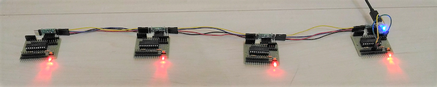
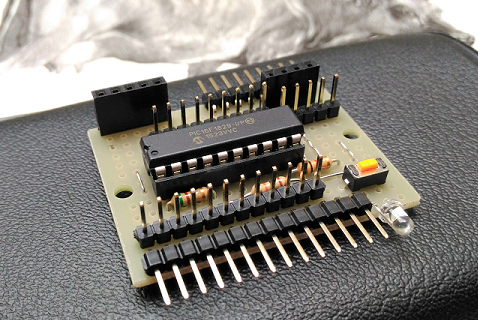
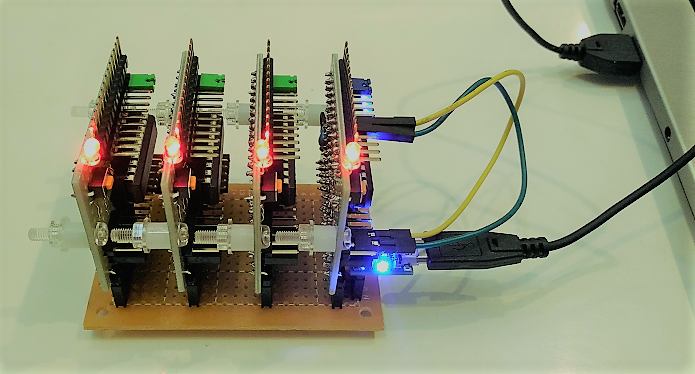

# Local wired sensor network

## Background and motivation

#### Problems

I have developed a lot of IoT prototypes so far, then I have observed that most of my IoT projects require a communication protocol for wired sensor networking, satisfiying the requirements below:

- low power consumption and lower voltage (5V or 3.3V)
- bus topology rather than hub and spoke
- two-wire
- cheap (~$1 per node) and open
- small software footprint

There are a lot of such technologies for in-vehicle network (CAN/LIN), buidling management (BACnet) or factory automation (PROFINET), but none of them satisfies the requirements above.

This is a project to develop a networking protocol and building blocks for local wired sensor network.



#### Hardware-version of Node-RED

I use [Node-RED](https://nodered.org/) quite often to visualize sensor data. Nodes on Node-RED are connected with each other via wires. I imagined something like hardware-version of flow-based programming.

## Network architecture

The network is composed of multiple nodes(blocks) and one scheduler.

```
     -----+---------------------+---------------------------+-------- bus
          |                     |                           |
   +------|-----+        +------|-----+              +------|-----+
   |   [node]   |        |   [node]   |              |   [node]   |
   |      |     |        |      |     |              |      |     |                  (         )
   |  [sensor]  |        |  [sensor]  |              |      +------------[IoT GW]---(   Cloud   )
   +------------+        +------------+    . . .     +------------+                  (         )
       block                 block                     scheduler
      (slave)               (slave)                    (master)
```

#### Interfaces among blocks

All the blocks developed in this project support [Plug&Play protocol](./doc/PROTOCOL.md) that runs on UART.

```
                    USB hub
                     +---+
[block A]--UART/USB--|   |
[block B]--UART/USB--|   |--USB--[IoT GW]
[block C]--UART/USB--|   |
                     +---+
                     
               hub&spoke topology
```

It also runs on I2C: [I2C backplane specification](./doc/I2C_BACKPLANE_SPEC.pptx).

```
      <- - - - - I2C backplane - - - - ->
[block A]---[block B]---[block C]---[Scheduler]--UART/USB--[IoT GW]

            bus topology (daisy-chain)
```

#### 8bit MCU as core of node

I use [PIC16F1829](http://ww1.microchip.com/downloads/en/DeviceDoc/41440A.pdf) that satisfies the requirements.

#### Node prototype

The base board below is a common hardware part of node:




## Networking examples

One I2C master and three I2C slaves are connected with each other via backplane bus:



A similar construct to the above, but all the boards are connected with each other via daisy-chain:


## Implementation

Note: I use [MPLAB Code Configurator (MCC)](http://www.microchip.com/mplab/mplab-code-configurator) to generate code for USART, I2C, PWM, Timer etc.

#### Plug&Play protocol

- [Plug&play protocol specification](./doc/PROTOCOL.md)
- [Implementation](./mini_plc/lib/protocol.X)

Including it as a library:
- [Step1: include the protocol library directory](./doc/mcc_eusart4.png)
- [Step2: include the protocol library in your project](./doc/mcc_eusart3.png)
- [Step3: exclude mcc generated eusart libraries from your project](./doc/mcc_eusart2.png)
- [Step4: enable eusart interrupts](./doc/mcc_eusart.png)

#### Blocks

- [5V: Character LCD actuator block (AQM1602XA-RN-GBW)](./mini_plc/i2c_slave_lcd.X), [pin assignment](./doc/lcd_pin.png)
- [5V: Acceleration sensor block （KXR94-2050)](./mini_plc/i2c_slave_accel.X), [pin assignment](./doc/acceleration_pin.png)
- [5V: Speed sensor block (A1324LUA-T)](./mini_plc/i2c_slave_speed.X), [pin assignment](./doc/rotation_pin.png)
- [5V: Temperature and humidity sensor block (HDC1000)](./mini_plc/i2c_slave_temp.X)
