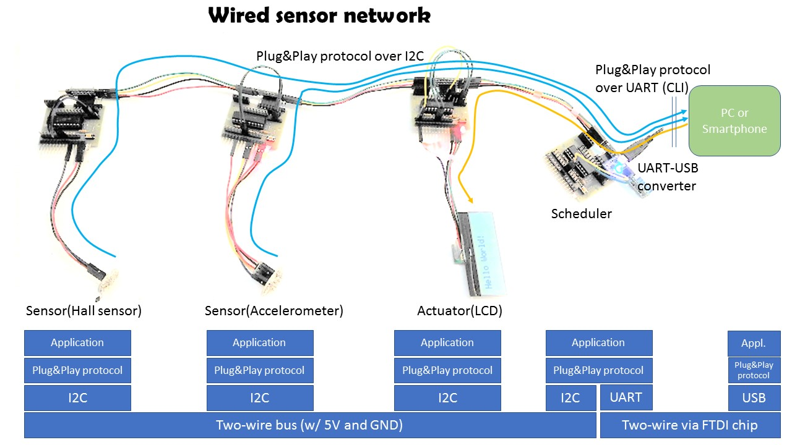
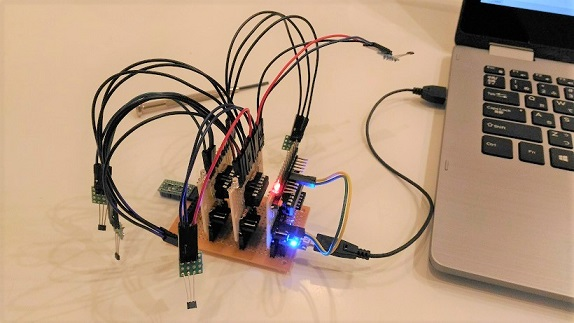

# Local wired sensor network



## Background and motivation

### Problems

I have developed a lot of IoT prototypes so far, then I have observed that most of my IoT projects require a communication protocol for wired sensor networking, satisfiying the requirements below:

- low power consumption and lower voltage (5V or 3.3V)
- bus topology (daisy-chain) rather than hub and spoke (star)
- two-wire or one-wire
- cheap (<$10 per node on average) and open
- small software footprint

There are a lot of such technologies for in-vehicle network (CAN/LIN), buidling management (BACnet) or factory automation (PROFINET), but none of them satisfies all the requirements above.

This is a project to develop a networking protocol and building blocks for local wired sensor network.

## Network architecture

The network is composed of multiple nodes(blocks) and one scheduler.

```
     -----+---------------------+---------------------------+-------- I2C bus
          |                     |                           |
   +------|-----+        +------|-----+              +------|-----+
   |   [node]   |        |   [node]   |              |   [node]   |
   |      |     |        |      |     |              |      |     |                      (         )
   |  [sensor]  |        |  [sensor]  |              |      +------------[IoT GW(*1)]---(   Cloud   )
   +------------+        +------------+    . . .     +------------+                      (         )
       block                 block                     scheduler
      (slave)               (slave)                    (master)

(*1) I use Node-RED (on RasPi or PC) and Android as IoT gateways.

```

Note: I am going to support CAN bus as well.

### Interfaces among blocks

All the blocks developed in this project support [Plug&Play protocol](./doc/PROTOCOL.md) that runs on UART.

```
                    USB hub
                     +---+
[block A]--UART/USB--|   |
[block B]--UART/USB--|   |--USB--[IoT GW]
[block C]--UART/USB--|   |
                     +---+

               hub&spoke topology
```

It also runs on I2C.

```
      <- - - - - I2C backplane - - - - ->
[block A]---[block B]---[block C]---[Scheduler]--UART/USB--[IoT GW]

            bus topology (daisy-chain)
```

### 8bit MCU as core of node

I use [PIC16F1829/PIC16F1825](http://ww1.microchip.com/downloads/en/DeviceDoc/41440A.pdf) that satisfies the requirements of this project.

Clock speed:
- 4MHz typical
- 32MHz (8MHz w/ PLL) for high sampling rate

### Node prototype

The base board below is a common hardware part of node:


## Networking examples

One I2C master and three I2C slaves are connected with each other via backplane bus on the back of base board


A similar construct to the above, but all the boards are connected with each other in a daisy-chain manner:


## Implementation

I use Microchip's MPLAB-X IDE. I also use [MPLAB Code Configurator (MCC)](http://www.microchip.com/mplab/mplab-code-configurator) to automatically generate code for EUSART, I2C(master/slave), ADC, Timer etc. I modify the generated I2C slave code to support Plug&Play protocol.

### Plug&Play protocol

[Plug&play protocol specification](./doc/PROTOCOL.md)

Some blocks operates in pubsub mode -- [how it works](./doc/PUBSUB.md).

#### Implementation: common part among all nodes

All nodes need to import this [protocol library](./blocks/pic16f1829/lib/protocol.X):
- [Step1: include the protocol library directory](./doc/mcc_eusart4.png)
- [Step2: include the protocol library in your project](./doc/mcc_eusart3.png)

#### Implementation: I2C-slave-specific part

I2C slaves also require I2C-slave-specific code -- I modified MCC-generated I2C slave code (i2c1.c) to support the protocol on I2C slave side. See this modifed code: [i2c1.c](./blocks/pic16f1829/i2c_slave_lcd.X/mcc_generated_files/i2c1.c).

#### Coding

The following is an example of main routine:

```
void main(void)
{    
    // Protocol initialization
    PROTOCOL_Initialize(DEVICE_ID, NULL, NULL, NULL, inv_handler, 250);

    // avoid using SYSTEM_Initialize() automatically generated by MCC,
    // because I2C1_Initialize() must be last in the initialization order
    PIN_MANAGER_Initialize();
    OSCILLATOR_Initialize();
    WDT_Initialize();
    ADC_Initialize();
    TMR0_Initialize();
    EUSART_Initialize();
    I2C1_Initialize();

    // Enable interrupt
    INTERRUPT_GlobalInterruptEnable();
    INTERRUPT_PeripheralInterruptEnable();

    // Infinite loop
    PROTOCOL_Loop();
}
```

### Blocks

#### PIC16F1829

In this project, PIC16F1829 MCU is used for general-purpose blocks such as a scheduler or LCD controller.

- [5V: Scheduler (BACKPLANE-MASTER)](./blocks/pic16f1829/i2c_master.X)
- [5V: Character LCD actuator block (AQM1602XA-RN-GBW)](./blocks/pic16f1829/i2c_slave_lcd.X)
- [5V: Acceleration sensor block （KXR94-2050)](./blocks/pic16f1829/i2c_slave_accel.X)
- [5V: Speed sensor block (A1324LUA-T)](./blocks/pic16f1829/i2c_slave_speed.X)
- [5V: Temperature and humidity sensor block (HDC1000)](./blocks/pic16f1829/i2c_slave_temp.X)
- [5V: Position detector block](./blocks/pic16f1829/i2c_slave_position.X)

#### PIC16F1825

In this project, PIC16F1825 MCU is used for purpose-specific blocks such as a position detector having multiple analog ports.

- [5V: Position detector block](./blocks/pic16f1825/i2c_slave_position.X)



Example of its usage
```
#WHO
$:WHO:MULTI_A1324LUA_T
#MAP
$:MAP:21,22
#RSC
$:RSC:0,0,0,0|0,0,0,0|0,0,0,0|0,0,0,0|0,0,0,0|0,0,0,0|0,0,0,0
#POS:0
#WSC:21
#POS:1
#WSC:22
#RSC
$:RSC:21,22,0,0|0,0,0,0|0,0,0,0|0,0,0,0|0,0,0,0|0,0,0,0|0,0,0,0
#I2C:21
#WHO
$:WHO:21
#SET:15
#I2C:22
#SET:9
#I2C:1
#STA
%21:UINT8_T:0,1,0,0
%21:UINT8_T:0,0,0,0
%21:UINT8_T:0,0,0,1
%21:UINT8_T:0,0,0,0
%21:UINT8_T:0,0,0,1
%21:UINT8_T:0,0,0,0
%21:UINT8_T:0,1,0,0
%21:UINT8_T:0,0,0,0
%21:UINT8_T:1,0,0,0
%21:UINT8_T:0,0,0,0
%21:UINT8_T:0,1,0,0
%21:UINT8_T:0,0,0,0
%21:UINT8_T:0,0,0,1
%21:UINT8_T:0,0,0,0
%21:UINT8_T:0,0,1,0
%21:UINT8_T:0,0,0,0
%22:UINT8_T:0,0,0,1
%22:UINT8_T:0,0,0,0
%22:UINT8_T:1,0,0,0
%22:UINT8_T:0,0,0,0
```

#### Initial config

Write I2C slave address on the blocks. For exmaple, if the address is 16 in decimal, then:
```
#WDA:16
#RDA
$:RDA:16
```

### CLI example

```
#WHO
$:WHO:BACKPLANE-MASTER
#SCN
#MAP
$:MAP:16,17,19
$:RSC:0,0,0,0|0,0,0,0|0,0,0,0|0,0,0,0|0,0,0,0|17,0,0,0|0,0,0,0
#POS:12
#WSC:19
#RSC
$:RSC:0,0,0,0|0,0,0,0|0,0,0,0|19,0,0,0|0,0,0,0|17,0,0,0|0,0,0,0
#STA
%17:UINT16_T:0
%19:FLOAT:-0.07,-0.08,0.94
%19:FLOAT:-0.05,-0.06,0.94
%19:FLOAT:-0.07,-0.06,0.94
%19:FLOAT:-0.06,-0.07,0.93
%19:FLOAT:-0.07,-0.08,0.94
%19:FLOAT:-0.05,-0.09,0.94
%19:FLOAT:-0.06,-0.09,0.94
%19:FLOAT:-0.05,-0.08,0.93
%19:FLOAT:-0.07,-0.08,0.93
%19:FLOAT:-0.06,-0.07,0.94
%19:FLOAT:-0.07,-0.07,0.94
%19:FLOAT:-0.06,-0.07,0.93
%19:FLOAT:-0.07,-0.08,0.93
             :
#I2C:16
$:WHO:16
#CLR
#LED:ON
#LED:OFF
#STR:Hello World!
#NWL
#STR:Guten Tag!
#I2C:1
            :
#STP
*:STP:ACK
```

### Interface to the scheduler

Use the CLI to control the scheduler or stream sensor data to the cloud.

#### via VCP over ttyUSBX(Linux)/COM port(Windows)
- Python: [pySerial](https://pythonhosted.org/pyserial/)
- Node.js: [serialport](https://www.npmjs.com/package/serialport)

#### via D2XX driver
- Java/Android: [D2XX driver](http://www.ftdichip.com/Android.htm)

### Physical wiring among blocks

In some projects, I used telephone line (6P4C) with RJ11 moduler plug/jack, as I2C bus. I used this tool to make wires among nodes: [Crimper for RJ11](http://www.mco.co.jp/products/tel/telephonetool/ta-642t.html). Telephone line makes physical wirling very easy.

6P4C telephone line is suitable for I2C with power line: SDA, SCL, 5V, GND.
