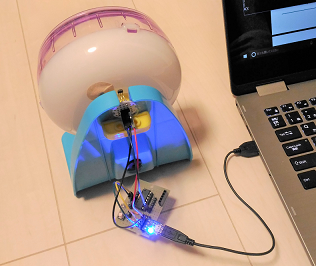
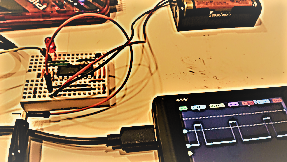
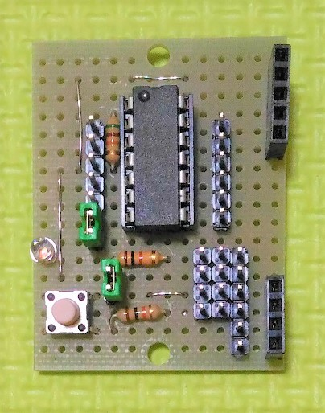
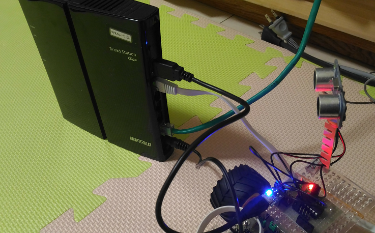

# Building blocks for smart home and smart office with 8bit MCUs



## Background and motivation

It is very common that networking equipment supports CLI over a console port or SSH. I wonder if any home equipment or any office equipment supported CLI over serial interfaces at a minimal cost, so that any MCUs including 8bit ones can support it.

This project is to see what happens if home/office equipment supported such "cheap" CLI.

I assume that a networking gear such as a router works as a controller for the home/office. In that sense, I am becoming interested in Fog Computing.

I use Microchip PIC16F1 series 8bit MCU to develop prototypes in this project.



## UART (i.e., serial) as universal interface

Even low-end 8bit MCUs support UART, so UART is the most common communication interface of MCUs. You can add brdiges/tranceivers(USB/Ethernet/RS485/LIN...) to MCUs to extend the maximum cable length of UART.

All the blocks developed in this project support [Plug&Play protocol](./doc/PROTOCOL.md) that is "CLI over UART" as open APIs targeting home/office equipment.


I use [FTDI](http://www.ftdichip.com/)'s USB-UART bridges that support [VCP (Virtual COM Port)](http://www.ftdichip.com/Drivers/VCP.htm) so that Windows PC recognizes them as COM ports:

- Linux automatically load a driver for FTDI chip and recognizes it as "/dev/ttyUSB\*" device.
- Windows PC automatically download [the FTDI driver for Windows](http://www.ftdichip.com/Drivers/VCP.htm) from the Internet (or you need to install it manually) for the first time, then recognizes it as COM\* device.
- In case of OpenWrt, you need to install [the FTDI driver for OpenWrt](https://wiki.openwrt.org/doc/hardware/port.serial) manually by using opkg package manager.

## PIC16F1 MCU models

|Model     |# of pins |Characteristics                 |
|----------|-----|--------------------------------|
|[PIC16F1455](http://ww1.microchip.com/downloads/en/DeviceDoc/40001639B.pdf)|14   |Built-in USB                    |
|[PIC16F1459](http://ww1.microchip.com/downloads/en/DeviceDoc/40001639B.pdf)|20   |Built-in USB                    |
|[PIC16F1508](http://ww1.microchip.com/downloads/en/DeviceDoc/41609A.pdf)|20   |CLCs                            |
|[PIC16F1509](http://ww1.microchip.com/downloads/en/DeviceDoc/41609A.pdf)|20   |CLCs                            |
|[PIC16F1825](http://ww1.microchip.com/downloads/en/DeviceDoc/41440A.pdf)|14   |Variety of Serial communications|
|[PIC16F1829](http://ww1.microchip.com/downloads/en/DeviceDoc/41440A.pdf)|20   |Variety of Serial communications|

## Communication modules

- [USB-UART bridge with 5V supply]
- [USB-UART bridge with 3.3V supply](./doc/STEP_DOWN.md)
- [ESP8266(ESP-WROOM-02)]
- [USB Micro B connector(for PIC16F1455/1459)](http://akizukidenshi.com/catalog/g/gK-06656/)

## Base board prototyping for IoT building blocks

#### Base board prototype #2

This prototype uses PIC16F1825. It costs around $3, much cheaper than A\*duino, but it requires one hour for soldering components onto the universal board.



- 51k ohm pull-up register sits between Vdd and MCLR pins
- The 5P pin socket is for PICkit3.
- The green jumper pin is to enable/disable the LED blinking.
- The tactile switch is a reset button: shorts MCLR pin to GND.

#### Schematic of the base board

The following is schematic of the base board prototype #2:


|Jumper pin|on           |off         |
|----------|-------------|------------|
|J1        |Enable LED   |Disable LED |
|J2        |Tactile SW as reset button|Tactile SW as general purpose SW|

## Firmware implementation

Note: I use [MPLAB Code Configurator (MCC)](http://www.microchip.com/mplab/mplab-code-configurator) to generate code for USART, I2C, PWM, Timer etc.

#### PIC16F1825

- [5V: Just red LED & tactile switch (Omron B3J-1000 or small one)]
- [5V: Solenoid (SparkFun ROB11015)]
- [5V: Distance sensor block (HC-SR04)](./pic16f1825/distance.X), [pin assignment](./doc/distance_pin.png)
- [5V: Acceleration sensor block （KXR94-2050)](./pic16f1825/acceleration.X), [pin assignment](./doc/acceleration_pin.png)
- [5V: Speed sensor block (A1324LUA-T)](./pic16f1825/rotation.X), [pin assignment](./doc/rotation_pin.png)
- [5V: Servo motor actuator block (TowerPro sg90)](./pic16f1825/servomotor.X), [pin assignment](./doc/servomotor_pin2.png), [duty at 3%](./doc/duty@3.BMP), [duty at 12%](./doc/duty@12.BMP)

#### PIC16F1829

- [3.3V: Orientation sensor block (HMC5883L and L3GD20)](./pic16f1829/orientation.X), [pin assignment](./doc/orientation_pin.png)
- [5V: Servo motor actuator block (TowerPro sg90)](./pic16f1829/servomotor.X), [pin assignment](./doc/servomotor_pin.png)

Note: calibrating HMC5883L is a little hard. I read the data sheet that shows how to calibrate it.

#### Usage

=> [USAGE](./doc/USAGE.md)

## Non-PIC blocks

- [USB video with OpenCV](./camera)
- [Text-to-Speech for Japanese]

## Plug&play protocol

- [Plug&play protocol specification](./doc/PROTOCOL.md)
- [Implementation](./pic16f1825/lib/protocol.X)

#### Including it as a library

- [Step1: include the protocol library directory](./doc/mcc_eusart4.png)
- [Step2: include the protocol library in your project](./doc/mcc_eusart3.png)
- [Step3: exclude mcc generated eusart libraries from your project](./doc/mcc_eusart2.png)
- [Step4: enable eusart interrupts](./doc/mcc_eusart.png)

## Use cases

#### Working with Python

=> [IoT gateway implementation](./agent)

#### Working with Juputer/IPython

I connected the acceleration sensor block to my laptop PC on which Node-RED was running. Then I performed actual measurement with the sensor on a bus. All the data was saved on MongoDB via Node-RED, and I dumped it on a file in CSV format.

- [Data](./jupyter/accelerometer.csv)
- [Jupyter notebook](./jupyter/bus.ipynb)

I noticed that Physics is in the heart of IoT:
- F = ma
- v = v0 + at

#### Working with Node-RED

It is pretty easy to integrate these blocks with Node-RED. I have run Node-RED on my RasPi 3 as well as on Windows PC:
- [node-red-1](./doc/node-red-1.png)
- [node-red-2](./doc/node-red-2.png)

#### Using the blocks with UNIX pipe

- Reading data from a sensor and feeding it to other UNIX commands via a pipe:
```
$ cat /dev/serial/by-id/<device_id> | command 1 | command 2 ...
```

- Sending data to a sensor/actuator:
```
$ echo <command> > /dev/serial/by-id/<device_id>
```

#### Using the blocks with OpenWrt

==> [OpenWrt](./openwrt)

I run OpenWrt on my router (Buffalo BHR-4GRV) that I bought in Akihabara, Tokyo. The router was really cheap and the price was around $30.

The router is also equipped with one USB port, thus my router works as IoT gateway for the blocks developed in this project.



OpenWrt is free OS for IoT gateways as well as for WiFi routers.

For example, I connect the acceleration sensor block to my router, then I think that it may work as a distributed earthquake sensing system.

#### Internet of Hamsters

See this [video](https://youtu.be/PpgvDuwcBxU) on YouTube.

I used [this small magnet for healthcare](http://www.elekiban.com/products/).

## Managing the system with Ansible

==> [Ansible](./ansible)

I have been using Ansible to manage the system:
- sensor/actuator blocks
- IoT gateways (RasPi/OpenWrt)

## IoT in the real world

#### Industry 4.0

There is a standard protocol ["IO-Link"](http://www.io-link.com/en/Technology/what_is_IO-Link.php?thisID=73) standardized by IEC. The goal of IO-Link is similar to my goal, except that my project targets RasPi and small routers/OpenWrt as a PLC-like controller for hobby-use sensor/actuator components.

#### In-vehicle networking

- [LIN](https://en.wikipedia.org/wiki/Local_Interconnect_Network)

#### Smart home / HEMS

- [DLNA](https://www.dlna.org/) and [DTCP-IP](https://en.wikipedia.org/wiki/Digital_Transmission_Content_Protection)
- [ECHONET](https://echonet.jp/english/)
- [Home controller(Panasonic)](http://www2.panasonic.biz/es/densetsu/ha/mansion_ha/syohin/pvjcontroller/)

#### Smart office

- [Yanzi Networks](https://yanzi.se/index.jsp)

#### Controllers

- [Siemens SIMATIC IOT2020](http://w3.siemens.com/mcms/pc-based-automation/en/industrial-iot/pages/default.aspx)
- [Phoenix RPI-BC](https://www.phoenixcontact.com/online/portal/gb?1dmy&urile=wcm:path:/gben/web/offcontext/insite_landing_pages/efd3ca11-79cd-4971-a56c-3c20e29139ad/efd3ca11-79cd-4971-a56c-3c20e29139ad)

#### IoT frameworks

- [OpenFog](https://www.openfogconsortium.org/)
- [Fuse](https://medium.com/@gigastacey/dell-plans-an-open-source-iot-stack-3dde43f24feb#.ggg76e529)
- [OpenWrt](http://events.linuxfoundation.org/sites/events/files/slides/Intelligent%20IoT%20Gateway%20on%20OpenWrt.pdf#search=%27OpenWrt+IoT%27)
- [Sakura IoT](https://iot.sakura.ad.jp/)
