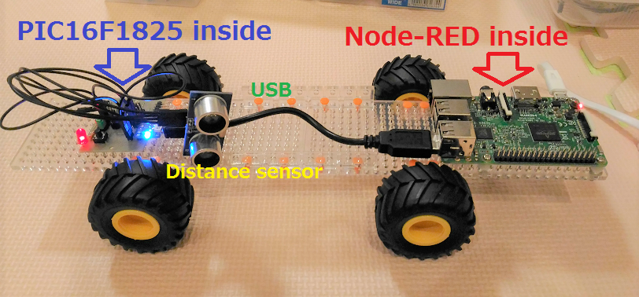
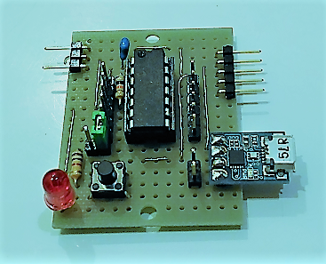

# Blocks: pretty-easy IoT



## Background and motivation

GPIO, I2C, SPI and UART/USART are widely adopted by sensor/actuator components. However, IT guys are not familiar with those low-level interfaces.

I have decided to develop a gateway that works as a bridge between those low-level interfaces and serial (UART/USB).

## Common architecture

```

<--- IoT low-level block ---->
sensor
actuator      MCU     Comm. module
  +---+      +---+      +---+         +---
  |   |      |   |      |   |         | Win PC
  |   |--*1--|   |--*2--|   |---USB---| RasPi
  |   |      |   |      |   |         | IoT gateway
  +---+      +---+      +---+         +---

*1 GPIO/I2C/SPI/UART
*2 UART

MCU works as such a gateway.
```
I use Microchip PIC16F1 series MCU to develop the block.

## USB/UART (i.e., serial) as universal interface for IoT blocks

All the blocks support USB/UART interface. I use two types of bridges to connect the blocks to the Internet:

IoT blocks with USB-UART bridge(*1):
```
                                   +-----+                      
[sensor block 1]-UART-[*1]---USB---|     |                    (        )
[sensor block 2]-UART-[*1]---USB---| USB |---[IoT gateway]---( Internet )
[actuator block 1]-UART-[*1]--USB--| hub |    such as RasPi   (        )
[actuator block 2]-UART-[*1]--USB--|     |
                                   +-----+
```

Note: In case of PIC16F1455/1459, USB-UART bridge is unnecessary.

IoT blocks with MQTT-UART bridge:
```
                   MQTT-UART bridge
                      +-------+                (        )
[sensor block 3]-UART-|ESP8266|---MQTT/WiFi---( Internet )
                      +-------+                (        )            
```

## PIC16F1 models

|Model     |# of pins |Characteristics                 |
|----------|-----|--------------------------------|
|[PIC16F1455](http://ww1.microchip.com/downloads/en/DeviceDoc/40001639B.pdf)|14   |Built-in USB                    |
|[PIC16F1459](http://ww1.microchip.com/downloads/en/DeviceDoc/40001639B.pdf)|20   |Built-in USB                    |
|[PIC16F1508](http://ww1.microchip.com/downloads/en/DeviceDoc/41609A.pdf)|20   |CLCs                            |
|[PIC16F1509](http://ww1.microchip.com/downloads/en/DeviceDoc/41609A.pdf)|20   |CLCs                            |
|[PIC16F1825](http://ww1.microchip.com/downloads/en/DeviceDoc/41440A.pdf)|14   |Variety of Serial communications|
|[PIC16F1829](http://ww1.microchip.com/downloads/en/DeviceDoc/41440A.pdf)|20   |Variety of Serial communications|

## Communication modules

- [USB-UART bridge with 5V supply]
- [USB-UART bridge with 3.3V supply](./doc/STEP_DOWN.md)
- [ESP8266(ESP-WROOM-02)]
- [USB Micro B connector(for PIC16F1455/1459)](http://akizukidenshi.com/catalog/g/gK-06656/)

## prototype

This prototype uses PIC16F1825:



- 10k ohm pull-up register sits between Vdd and MCLR pins (50k ohm is better)
- The 5P pin header (L type) is for PICkit3.
- The 2P pin header (L type) supplies 5V/3.3V to a sensor/actuator component.
- The other 2P pin header is connected to TX/RX of the USB/UART bridge(FT234X)
- The 6P pin headers are connected to PIC16F1825.
- The LED (w/ 1k ohm register) blinks every while loop:
turn on/off every __delay_ms(period);
- The green jumper pin is to enable/disable the LED blinking.
- The tactile switch is a reset button: shorts MCLR pin to GND.

## Hardware schematic

The following is schematic of the base board. This is absolutely cheaper than A*duino.


|Jumper pin|on           |off         |
|----------|-------------|------------|
|J1        |Enable LED   |Disable LED |
|J2        |Tactile SW as reset button|Tactile SW as general purpose SW|

The blocks may use I2C for inter-block communications.  In that case, the master needs to hide all the details of low-level communications from the user.


## Firmware implementation

Note: I use MPLAB Code Configurator (MCC) to generate code for USART, I2C, PWM, Timer etc.

#### PIC16F1455

- [I2C-USB bridge]

#### PIC16F1825

- [5V: Just red LED & tactile switch (Omron B3J-1000 or small one)]
- [5V: Solenoid (SparkFun ROB11015)]
- [5V: Distance sensor block (HC-SR04)](./distance.X)
 - [pin assignment](./doc/distance_pin.png)
- [5V: Acceleration sensor block （KXR94-2050)](./acceleration.X)
- [5V: Spped sensor block (A1324LUA-T)](./rotation.X)

#### PIC16F1829

- [3.3V: Orientation sensor block (HMC5883L and L3GD20)](./orientation.X)
 - [pin assignment](./doc/orientation_pin.png)
- [5V: Servo motor actuator block (TowerPro sg90)](./servomotor.X)
 - [pin assignment](./doc/servomotor_pin.png)

Note: calibrating HMC5883L is a little hard. I read the data sheet that shows how to calibrate it.

## Non-PIC blocks

- [USB video with OpenCV]
- [Text-to-Speech for Japanese]

## Using the blocks with UNIX pipe

It is pretty easy!

Things are recognized as "tty devices" on UNIX/Linux or as "COM ports" on Windows.

Linux also supports "/dev/serial/by-id" that assigns an unique name to each thing.

- Reading data from a sensor and feeding it to other UNIX commands via a pipe:
```
$ cat /dev/serial/by-id/<device_id> | command 1 | command 2 ...
```

- Sending data to a sensor/actuator:
```
$ echo <command> > /dev/serial/by-id/<device_id>
```

See this [usage](./doc/USAGE.md) page.

## Node-RED for rapid IoT prototyping

Node-RED is thought of as a good tool for rapid prototyping in IoT communities.

All the blocks just use USB as an interface to IoT gateway, so it is pretty easy to integrate these blocks with Node-RED.

I run Node-RED on my RasPi 3:


I am currently developing flows using the blocks: [node-red flows](./node-red).

## TTY setting

- TTY initialization

  Before starting Node-RED, disable "\n to \r\n" translation:
```
$ stty -F /dev/serial/by-id/<device_id> -onlcr
```

- Recovering from broken TTY

  Try this:
```
$ echo ^c^o > /dev/serial/by-id/<device_id>
```

- Showing the tty settings

  ```
$ stty -F /dev/serial/by-id/<device_id> -a
speed 9600 baud; rows 0; columns 0; line = 0;
intr = ^C; quit = ^\; erase = ^?; kill = ^U; eof = ^D; eol = <undef>;
eol2 = <undef>; swtch = <undef>; start = ^Q; stop = ^S; susp = ^Z; rprnt = ^R;
werase = ^W; lnext = ^V; flush = ^O; min = 1; time = 0;
-parenb -parodd -cmspar cs8 hupcl -cstopb cread clocal -crtscts
-ignbrk -brkint ignpar -parmrk -inpck -istrip -inlcr -igncr icrnl -ixon -ixoff
-iuclc -ixany -imaxbel -iutf8
-opost -olcuc -ocrnl -onlcr -onocr -onlret -ofill -ofdel nl0 cr0 tab0 bs0 vt0 ff0
-isig -icanon -iexten -echo -echoe -echok -echonl -noflsh -xcase -tostop -echoprt
-echoctl -echoke
```

## Future work

#### TTL serial JPEG camera

I want to develop a block supporting video with this TTL serial camera:
http://akizukidenshi.com/catalog/g/gM-11506/

#### Ansible

I am going to study [Ansible](https://www.ansible.com/) to see if it can be used for managing Node-RED:
- settings.js (config management)
- flow management
- node management
