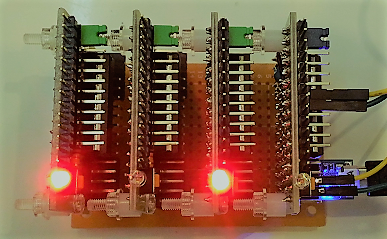
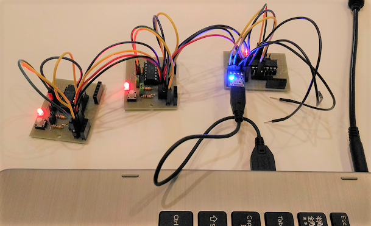

# Mini PLC with Microchip PIC16F1

This is a project to develop mini PLC (Programmable Logic Controller) in a building-block manner.



Plug&Play protocol are supported for a master board to recognize capabilities of all its slaves in a plug&play manner.

## Interfaces among building blocks

All the blocks developed in this project support [Plug&Play protocol](./doc/PROTOCOL.md) that runs on UART.

```
                    USB hub
                     +---+
[block A]--UART/USB--|   |
[block B]--UART/USB--|   |--[PC or small router]
[block C]--UART/USB--|   |
                     +---+
```

It also runs on I2C: [I2C backplane specification](./doc/I2C_BACKPLANE_SPEC.pptx).

```
[block A]---[block B]---[block C]---[Scheduler]--UART/USB--[PC or small router]
```

## PIC16F1 MCU models

The following MCUs are used in this project:

|Model     |# of pins |Characteristics                 |
|----------|-----|--------------------------------|
|[PIC16F1825](http://ww1.microchip.com/downloads/en/DeviceDoc/41440A.pdf)|14   |Variety of Serial communications|
|[PIC16F1829](http://ww1.microchip.com/downloads/en/DeviceDoc/41440A.pdf)|20   |Variety of Serial communications|


## Communication modules for UART

- [UART-USB converter with 5V supply](http://akizukidenshi.com/catalog/g/gM-08461/)
- [UART-RS232 converter](https://www.amazon.co.jp/NulSom-Inc-NS-RS232-02-H-%E6%A5%B5%E5%B0%8FRS232-TTL%E3%82%B3%E3%83%B3%E3%83%90%E3%83%BC%E3%82%BF%E3%83%A2%E3%82%B8%E3%83%A5%E3%83%BC%E3%83%AB-%EF%BC%A4%E3%82%B5%E3%83%96%EF%BC%99%E3%83%94%E3%83%B3%E3%82%AA%E3%82%B9%E3%82%B3%E3%83%8D%E3%82%AF%E3%82%BF%EF%BC%88%E3%82%B1%E3%83%BC%E3%82%B9%E3%82%AD%E3%83%83%E3%83%88%E4%BB%98%E3%81%8D%EF%BC%89/dp/B00OPWLXDW/ref=sr_1_8?ie=UTF8&qid=1491089182&sr=8-8&keywords=rs232+TTL)/[Manual](http://www.nulsom.com/datasheet/NS-RS232_en.pdf#search=%27NULSON+RS232C%27)
- [UART-WiFi with ESP8266(ESP-WROOM-02)]

## Base boards

#### PIC16F1825

The base board board described here is used as USB/UART devices.


- 51k ohm pull-up register sits between Vdd and MCLR pins
- The 5P pin socket is for PICkit3.
- The green jumper pin is to enable/disable the LED blinking.
- The tactile switch is a reset button: shorts MCLR pin to GND.

The following is schematic of the base board prototype #2:


|Jumper pin|on           |off         |
|----------|-------------|------------|
|J1        |Enable LED   |Disable LED |
|J2        |Tactile SW as reset button|Tactile SW as general purpose SW|

The base board will also supports I2C bus network topology:




#### PIC16F1829


##### Construct examples

One I2C master and three I2C slaves are connected with each other via backplane bus:


A similar construct to the above, but all the boards are connected with each other via daisy-chain:


To extend the distance of bus signal reachability, use CAN standalone controller (SPI): [MCP2525](http://ww1.microchip.com/downloads/en/DeviceDoc/21801e.pdf).

## Implementation

Note: I use [MPLAB Code Configurator (MCC)](http://www.microchip.com/mplab/mplab-code-configurator) to generate code for USART, I2C, PWM, Timer etc.

#### Plug&Play protocol

- [Plug&play protocol specification](./doc/PROTOCOL.md)
- [Implementation](./mini_plc/lib/protocol.X)

Including it as a library:
- [Step1: include the protocol library directory](./doc/mcc_eusart4.png)
- [Step2: include the protocol library in your project](./doc/mcc_eusart3.png)
- [Step3: exclude mcc generated eusart libraries from your project](./doc/mcc_eusart2.png)
- [Step4: enable eusart interrupts](./doc/mcc_eusart.png)

#### Devices

=> [USAGE](./doc/USAGE.md)

- [5V: Just red LED & tactile switch (Omron B3J-1000 or small one)]
- [5V: Solenoid (SparkFun ROB11015)]
- [5V: Character LCD actuator block](./mini_plc/i2c_slave_lcd.X), [pin assignment](./doc/lcd_pin.png)
- [5V: Distance sensor block (HC-SR04)], [pin assignment](./doc/distance_pin.png)
- [5V: Acceleration sensor block （KXR94-2050)](./mini_plc/i2c_slave_accel.X), [pin assignment](./doc/acceleration_pin.png)
- [5V: Speed sensor block (A1324LUA-T)](./mini_plc/i2c_slave_speed.X), [pin assignment](./doc/rotation_pin.png)
- [5V: Servo motor actuator block (TowerPro sg90)], [pin assignment](./doc/servomotor_pin2.png), [duty at 3%](./doc/duty@3.BMP), [duty at 12%](./doc/duty@12.BMP)
