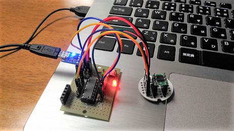

## PIC16F1825

#### Acceleration sensor board (3.3V/5V)



Board
```
y
^          o Vout z-axis -- 8 pin
|  [Chip]  o Vout y-axis -- 11 pin
+--> x     o Vout x-axis -- 3 pin
           o GND
           o Vdd (2.5V - 5.25V)
```

Output example
```
492,512,715
493,513,715
492,513,716
     :
```

UART
```
           TX --> 5 pin (RX)
           RX <-- 6 pin (TX)
```

#### Hall sensor board (5V)

Board
```
          o Vcc
  [Chip]  o GND
          o Vout -- 8 pin
```

Output example
```
1
1
1
:
```

UART
```
           TX --> 5 pin (RX)
           RX <-- 6 pin (TX)
```

#### LED and switch (3.3V/5V)

```
             o Vdd
 [Switch]    o GND
             o Vout (digital)
 [LED][LED]  o Vin (LED red)
             o Vin (LED blue)
```
