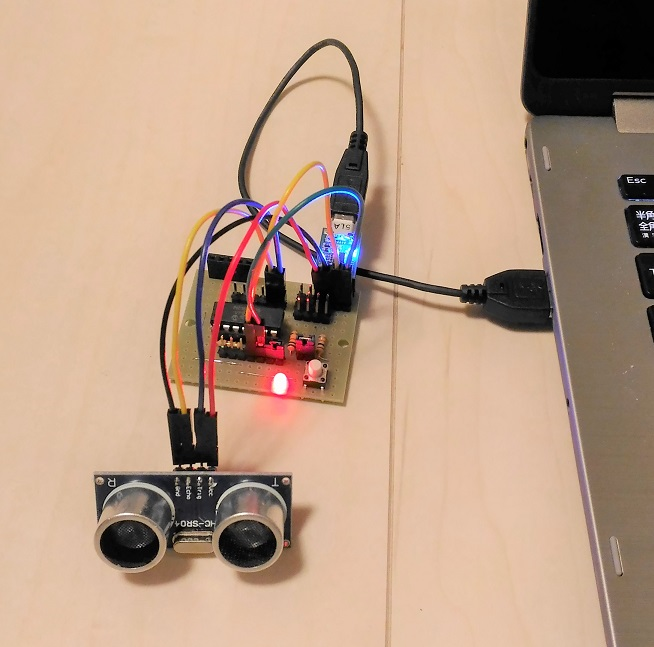
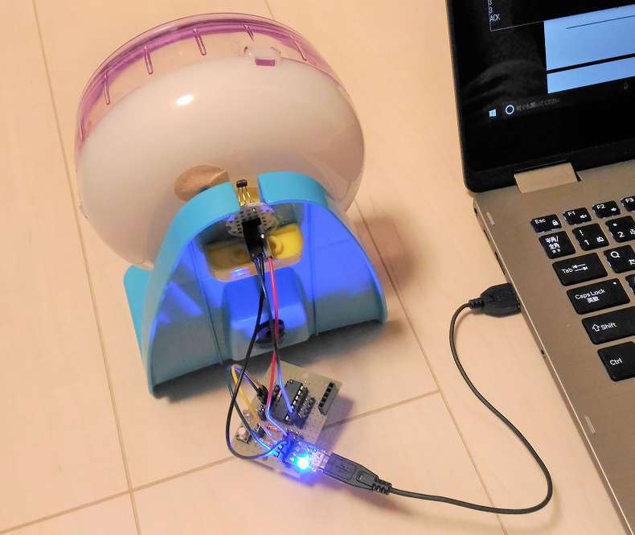
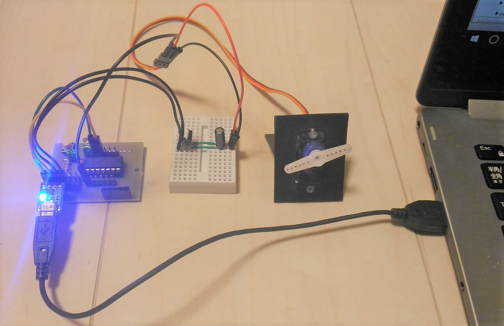

## Sensor blocks (compliant to the Plug&Play protocol)

|Sensor      |Device ID     |Set range         |Meaning             | Set actual value     |Data                                            |
|------------|--------------|------------------|--------------------|----------------------|------------------------------------------------|
|Distance    |HC-SR4        |10 ~ 255          |Measurement period  |0.1sec ~ 2.55sec      |Distance in cm or -1(out of range)              |
|Rotation    |A1324LUA-T    |0 or 1 ~ 255      |Measurement period  |0 or 1sec ~ 255sec    |revolutions or "1" at every revolution(period=0)|
|Acceleration|KXR94-2050    |NA                |NA                  |NA                    |Milli-G for X, Y and Z axis in CVS              |
|Servomotor  |TOWER-PRO-SG90|0 ~ 180           |Angle in degrees    |0 ~ 180 degrees       |NA                                              |

### Distance block



Output sample
```
ACK
HC-SR04
VAL:100
4
3
2
-1
3
11
18
ACK
```

### Rotation block



Output sample
```
ACK
A1324LUA-T
VAL:5
7
9
8
4
3
3
ACK
```

### Servo motor block



Output sample
```
ACK
TOWER-PRO-SG90
VAL:100
ACK
```

### Acceleration block

Output sample
```
ACK
KXR94-2050
VAL:100
0.07,-0.37,0.90
0.07,-0.37,0.91
0.15,-0.42,0.98
0.00,-0.31,0.84
-0.09,-0.29,0.88
0.01,-0.48,0.96
0.08,-0.35,0.91
ACK
```
